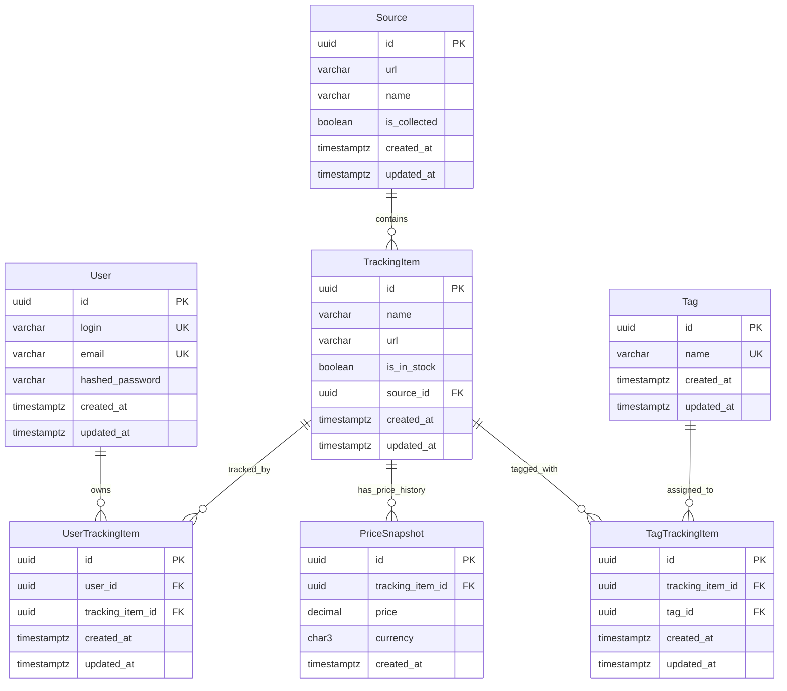

# База данных (ER-схема)

Цель: единое понимание модели домена между `Database.md` ↔ `API.md` ↔ `Parser Architecture.md`.

СУБД: **PostgreSQL**.

## Сущности и поля

### `User`

- `id` (UUID, PK)
- `login` (varchar, unique, not null)
- `email` (varchar, unique, not null)
- `hashed_password` (varchar, not null)
- `created_at` (timestamptz, not null)
- `updated_at` (timestamptz, not null)

### `Source`

- `id` (UUID, PK)
- `url` (varchar, not null) — базовый URL источника
- `name` (varchar, not null) — отображаемое имя
- `is_collected` (boolean, default false) — активен ли источник для сбора
- `created_at` (timestamptz, not null)
- `updated_at` (timestamptz, not null)

### `TrackingItem`

- `id` (UUID, PK)
- `name` (varchar, not null) — название товара
- `url` (varchar, not null) — полный URL товара
- `is_in_stock` (boolean, default false) — актуальный статус наличия
- `source_id` (UUID, FK → `Source.id`, not null)
- `created_at` (timestamptz, not null)
- `updated_at` (timestamptz, not null)

### `PriceSnapshot`

Срез цены "в момент времени".

- `id` (UUID, PK)
- `tracking_item_id` (UUID, FK → `TrackingItem.id`, not null)
- `price` (DECIMAL(12,2), not null) — цена товара
- `currency` (char(3), not null) — например `RUB`, `USD`
- `created_at` (timestamptz, not null) — момент фиксации цены

Дедупликация (на MVP):

- вариант 1: хранить все снимки, даже если одинаковые цены
- вариант 2: предотвращать дубли через уникальность `(tracking_item_id, created_at)` (с округлением до минуты/часа)

Рекомендация: вариант 2, чтобы ETL мог безопасно ретраить.

### `Tag`

- `id` (UUID, PK)
- `name` (varchar, unique, not null) — название тега
- `created_at` (timestamptz, not null)
- `updated_at` (timestamptz, not null)

### `UserTrackingItem` (связующая таблица)

Ассоциация пользователей с отслеживаемыми товарами (many-to-many).

- `id` (UUID, PK)
- `user_id` (UUID, FK → `User.id`, not null)
- `tracking_item_id` (UUID, FK → `TrackingItem.id`, not null)
- `created_at` (timestamptz, not null)
- `updated_at` (timestamptz, not null)

### `TagTrackingItem` (связующая таблица)

Ассоциация тегов с отслеживаемыми товарами (many-to-many).

- `id` (UUID, PK)
- `tracking_item_id` (UUID, FK → `TrackingItem.id`, not null)
- `tag_id` (UUID, FK → `Tag.id`, not null)
- `created_at` (timestamptz, not null)
- `updated_at` (timestamptz, not null)

## Связи (каркас)

- `User (1)` → `UserTrackingItem (many)` через `UserTrackingItem.user_id`
- `TrackingItem (1)` → `UserTrackingItem (many)` через `UserTrackingItem.tracking_item_id`
- `Source (1)` → `TrackingItem (many)` через `TrackingItem.source_id`
- `TrackingItem (1)` → `PriceSnapshot (many)` через `PriceSnapshot.tracking_item_id`
- `Tag (1)` → `TagTrackingItem (many)` через `TagTrackingItem.tag_id`
- `TrackingItem (1)` → `TagTrackingItem (many)` через `TagTrackingItem.tracking_item_id`

## Индексы (для быстрых запросов MVP)

- `PriceSnapshot`: индекс по `(tracking_item_id, created_at desc)` для быстрого получения последней цены
- `TrackingItem`: индекс по `(source_id, created_at desc)` для фильтрации по источнику
- `TrackingItem`: индекс по `is_in_stock` для поиска доступных товаров
- `UserTrackingItem`: составной индекс по `(user_id, tracking_item_id)` для быстрой проверки существования связи
- `TagTrackingItem`: составной индекс по `(tracking_item_id, tag_id)` для быстрой проверки связей тегов
- `Tag`: индекс по `name` для быстрого поиска тега по имени

## Дополнительные соображения

### Каскадные операции

- При удалении `User`: каскадно удалять связанные записи в `UserTrackingItem`
- При удалении `TrackingItem`: каскадно удалять `PriceSnapshot`, `TagTrackingItem`, `UserTrackingItem`
- При удалении `Tag`: каскадно удалять связи в `TagTrackingItem`
- При удалении `Source`: запрещать удаление (`RESTRICT`), если есть связанные `TrackingItem`

### Мягкое удаление (опционально для MVP)

Если требуется сохранение истории, добавить в сущности:

- `is_deleted` (boolean, default false)
- `deleted_at` (timestamptz, null)

Тогда:

- `User.is_deleted` — заблокированные/удалённые пользователи
- `TrackingItem.is_deleted` — скрытые товары (не удалять PriceSnapshot для истории)

### Расширения для будущих версий

- **AlertRule**: правила оповещения о снижении цены
- **AlertEvent**: события срабатывания правил
- **PriceSnapshot.status**: enum (`success`, `error`) для обработки ошибок парсинга
- **PriceSnapshot.availability**: enum (`in_stock`, `out_of_stock`, `unknown`) для фиксации доступности

## Миграции

- Используем **Alembic**.
- Правило нейминга миграций: `YYYYMMDD_HHMMSS_описательное_название` (например `20250327_120000_add_user_tracking_items`)
- Любые изменения в полях/типах (особенно `PriceSnapshot.price`) должны сопровождаться обновлением `API.md` и `Parser Architecture.md`.
- Миграции должны быть идемпотентными: проверять существование объектов перед созданием/изменением.

## ER-диаграмма (Mermaid)

